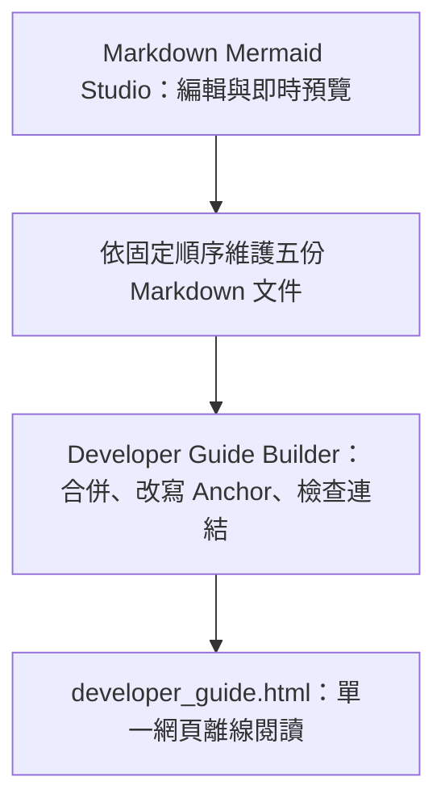

# Markdown Mermaid Studio 總覽

Markdown Mermaid Studio 是本機優先的 Markdown 與 Mermaid 工作台。編輯、文件、快照及偏好保存在目前瀏覽器，不需要登入、資料庫或付費 API。

## 兩層使用方式

日常工作分成兩層：

1. 在 Studio 網頁編輯、預覽及檢查單份 Markdown。
2. 以 Developer Guide Builder 將固定五份 Markdown 發布成一個可離線閱讀的 HTML。

## 快速導覽

- [多文件、快照及搜尋](02_workspace.md)
- [Mermaid 圖形與長文字換行](03_mermaid.md#長文字與中文換行)
- [五份文件合併與單頁發布](04_publish.md#建立單一-html)
- [Windows 長期維護與疑難排解](05_maintenance.md#windows-桌機長期維護)

## 安全與保存界線

- Markdown raw HTML 預設不執行。
- Mermaid 使用 `securityLevel: strict`。
- 瀏覽器工作區保存在 `localStorage`；重要內容應下載 Markdown 或匯出工作區 JSON。
- `developer_guide.html` 是發布產物，來源仍是 `docs/developer-guide` 下的五份 Markdown。

