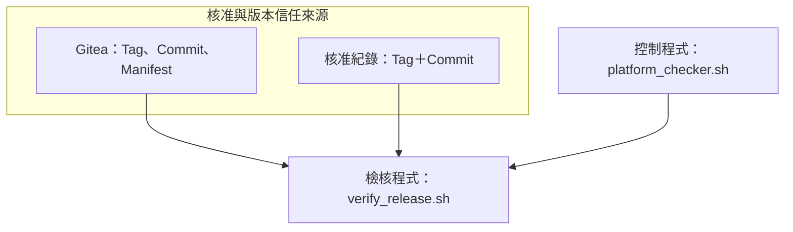

# Mermaid 圖形功能

## Mermaid 11.17.0

Studio 使用 Mermaid 11.17.0，提供核心圖表範本、語法檢查、錯誤行定位、縮放、原始碼複製，以及 SVG／PNG 下載。

常用圖形包括 Flowchart、Sequence、State、Class、ER、Gantt、Timeline、Mindmap、Git Graph、Sankey、C4、Journey 與 Block。

## 長文字與中文換行

Flowchart 節點、連線標籤及長 `subgraph` 標題會依合理寬度換行。修正同時涵蓋中文連續文字、檔名、底線、中英混合標點、HiDPI 與非整數瀏覽器縮放。

圖形預覽、下載 SVG、下載 PNG，以及 [單頁 HTML 發布](04_publish.md#mermaid-預先渲染) 共用相同的換行設定。

## Mermaid 錯誤與定位

語法錯誤會指出實際來源行，可直接跳回對應的 Mermaid code fence。Developer Guide Builder 遇到任何 Mermaid 渲染失敗時會停止，不會把錯誤圖形發布到正式 HTML。

## SVG 與 PNG 輸出

- SVG 適合文件發布與任意比例縮放。
- PNG 以 SVG `viewBox` 計算比例，使用自包含 data URI，最大邊長限制為 4096px。
- 包含外部圖片且受瀏覽器 Canvas 安全限制時，PNG 會顯示明確錯誤；SVG 仍是正式文件的優先格式。

